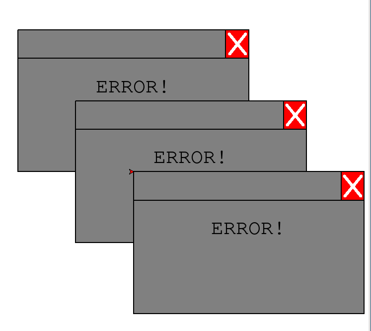

# Error Messages

Oh no! You clicked the wrong link and now your computer is filled with errors.

You will write code to create an image close to the one below:

## Provided Functions

You are provided a write_error() function that draws the "ERROR" message, relative to a certain size.
You should call the init() function to set up the board.

## Hints

The "ERROR" text is drawn by going about halfway down the short side of the rectangle, and about
halfway through the *long* side of the rectangle.

The "X" button's sides are about 1/5th the size of the rectangle's short side.

The decorator bar line is drawn about 1/5th the length of the rectangle's short side.

## Grading

* 10% - Use of functions
* 10% - Prompt to end program
* 10% - Gray background
* 10% - Repeated messages

* 20% - "X" button
* 20% - User Input
* 20% - MessageBox

## Extra Credit

For 10% extra credit, handle errors - for instance, if the user enters a string as a number, ask until they enter a correct value.
